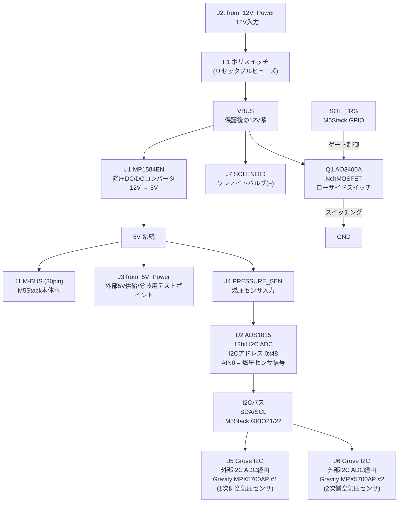

# Chibi-T_Furoshiki_AutoAirAdjust_PCB

M5Stack Basic / Core2 用の空気圧自動調整コントローラー基板の KiCad プロジェクトです。  
1次側・2次側の空気圧センサと燃圧センサの値を M5Stack で監視し、ソレノイドバルブの開閉によって
1次側から2次側への圧縮空気の流れを自動制御します。

## 概要

- 対応ホスト: M5Stack Basic / Core2（MBUS 30pin コネクタで直結するスタック型基板）
- センサ入力
  - 1次側・2次側 空気圧センサ：[DFRobot Gravity MPX5700AP (SEN0456)](https://wiki.dfrobot.com/sen0456/docs/18937) × 2 個
    （センサ自体はアナログ出力のため、 I2C ADC モジュール経由で Grove I2C バスに接続）
  - 燃圧センサ：0–1.0 MPa / 0.5–4.5V アナログ出力タイプ 1 個
    （基板上の 12bit ADC（ADS1015）で読み取り）
- アクチュエータ出力：DC12Vソレノイドバルブ 1 系統（1次側→2次側の圧縮空気の開閉弁を GPIO トリガーで駆動）
- 電源：車両/バッテリーの 12V 入力から基板上の降圧コンバータで 5V を生成し、 M5Stack と各センサへ供給

## システム構成



## 主な機能

1. **空気圧計測（1次側・2次側）**
   Gravity MPX5700AP を 2 個、I2C ADC モジュール経由で Grove I2C コネクタ（J5・J6）に接続し、
   M5Stack の I2C バス（GPIO21=SDA / GPIO22=SCL）上で読み取ります。  
   DFRobot Gravity MPX5700AP (SEN0456) のモジュール上の DIP スイッチで、I2Cアドレスは `0x16` 〜 `0x19` のいずれかに設定可能です。

2. **燃圧計測**
   0–1.0 MPa（0.5–4.5V 出力）のアナログ燃圧センサを J4（PRESSURE_SEN）に接続し、
   基板上の ADS1015（12bit I2C ADC、U2）の AIN0 チャンネルで読み取ります。  
   ADS1015 の ADDR ピンは GND に接続されており、I2C アドレスは `0x48` 固定です。

3. **ソレノイドバルブ制御**
   1次側から2次側への圧縮空気の通路を開閉するソレノイドバルブを、M5Stack の GPIO（GPIO34, SOL_TRG）
   からのトリガー信号で駆動します。  
   GPIO → ゲート抵抗 R8(1kΩ) → Q1(AO3400A, NchMOSFET) のローサイドスイッチ構成で、R9(12kΩ) がゲートのプルダウン（起動時の誤動作防止）、D2(1N4148WS) が逆起電力吸収用フライホイールダイオードです。

4. **電源生成**
   J2（from_12V_Power）から入力した車両/バッテリー電源は、F1（ポリスイッチ／リセッタブルヒューズ）で保護された後、U1（MP1584EN-LF-Z 降圧 DC/DC コンバータ）で 5V に変換されます。  
   5V は J1（M-BUS）経由で M5Stack 本体、および J4 の燃圧センサ電源として供給されます。  
   3.3V 系統は M5Stack 本体（MBUS 経由）からの供給を利用しており、基板上では ADS1015 の電源および I2C プルアップ抵抗（R6, R7）に使われます。  
   J3（from_5V_Power）は外部への5V供給、または分岐出力を取り出すためのテストポイント/コネクタです。

## コネクタ一覧

| 番号 | 名称 | 種類 | 用途 |
| --- | --- | --- | --- |
| J1 | M-BUS | 2x15 (30pin) | M5Stack Basic/Core2 本体との直結用バスコネクタ |
| J2 | from_12V_Power | JST XH 1x02 | 車両/バッテリーからの 12V 電源入力 |
| J3 | from_5V_Power | Conn 1x02 | 外部 5V 供給／分岐出力用テストポイント |
| J4 | PRESSURE_SEN | JST XH 1x03 | 燃圧センサ入力（+5V／信号(AIN0)／GND） |
| J5 | I2C | Grove 4pin | 外部I2C ADC経由で空気圧センサ(Gravity MPX5700AP)を接続 |
| J6 | I2C | Grove 4pin | 外部I2C ADC経由で空気圧センサ(Gravity MPX5700AP)を接続 |
| J7 | SOLENOID | JST XH 1x02 | ソレノイドバルブ駆動出力（VBUS系統をQ1でスイッチ） |

## 主要部品（抜粋）

| 部品番号 | 部品 | 役割 |
| --- | --- | --- |
| U1 | MP1584EN-LF-Z | 降圧DC/DCコンバータ（12V→5V、L1/R1/R3で出力電圧設定） |
| U2 | ADS1015IDGS | 12bit I2C ADC（燃圧センサ読み取り、I2Cアドレス 0x48） |
| Q1 | AO3400A | NchMOSFET（ソレノイドバルブのローサイドスイッチ） |
| D1 | Schottky | 電源保護用ダイオード |
| D2 | 1N4148WS | ソレノイドコイルのフライホイールダイオード |
| F1 | Polyfuse (Polyfuse_Small) | 12V入力のリセッタブルヒューズ |
| L1 | 10uH | 降圧コンバータのインダクタ |

部品表全体は [`production/bom.csv`](production/bom.csv) を参照してください。

## 基板仕様

- 基板サイズ：約 50.05mm × 50.05mm x 1.0mm
- 層数：2層（F.Cu / B.Cu）
- マウントホール：M3 × 4（H1–H4）、M2 × 4（H5–H8）
- KiCad バージョン：KiCad 8 系フォーマット

## ディレクトリ構成

```txt
├── Chibi-T_Furoshiki_AutoAirAdjust_PCB.kicad_pro   # プロジェクトファイル
├── Chibi-T_Furoshiki_AutoAirAdjust_PCB.kicad_sch    # 回路図
├── Chibi-T_Furoshiki_AutoAirAdjust_PCB.kicad_pcb    # 基板データ
├── C15051/                                          # MP1584EN 用シンボルライブラリ
├── OPL_Connector.lib / OPL_Connector.pretty/         # コネクタ用シンボル・フットプリントライブラリ
├── logos.pretty/                                    # 基板ロゴ用フットプリント
├── production/                                       # 製造用出力データ（ガーバー一式・BOM・部品配置等）
├── Chibi-T_Furoshiki_AutoAirAdjust_PCB-backups/      # KiCad 自動バックアップ（zip）
└── LICENSE.txt                                       # ライセンス（MIT）
```

## 製造データ

`production/` フォルダに、製造発注用のデータ一式が出力済みです。

- `Chibi-T_Furoshiki_AutoAirAdjust_PCB.zip` … ガーバー等一式
- `bom.csv` … 部品表
- `positions.csv` … 部品実装位置データ（ピックアンドプレース）
- `designators.csv` … 部品番号リスト
- `netlist.ipc` … IPC ネットリスト

## ファームウェア

M5Stack 側の制御プログラム（センサ読み取り・ソレノイド制御ロジック）は本リポジトリには含まれません。
別リポジトリで管理しています。

## ライセンス

MIT License（詳細は [`LICENSE.txt`](LICENSE.txt) を参照）
